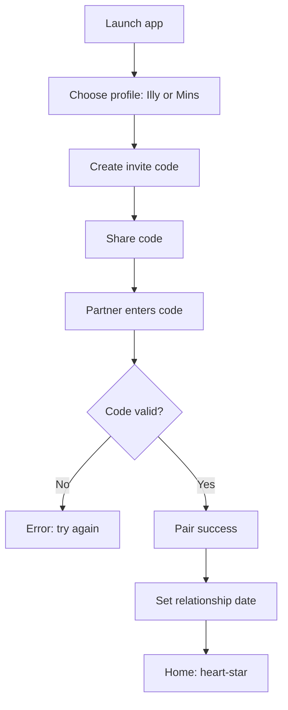

# UX Design Specification Darlen-ls

**Author:** eliot
**Date:** 2026-01-12-214153

---

<!-- UX design content will be appended sequentially through collaborative workflow steps -->

## Executive Summary

### Project Vision

Darlen-ls is a private, two-person Android app that makes emotional closeness feel instant and effortless through a heartbeat signal that arrives even when the app is closed. It blends a low-friction "I'm here" signal with structured emotional support tools for daily reassurance and co-regulation.

### Target Users

Two long-distance partners (Illy in Rabat, Mins in Islamabad) on Android who want a quiet, immediate connection without typing or social-app clutter.

### Key Design Challenges

- Make the heartbeat feel fast, reliable, and emotionally meaningful with near-zero friction.
- Balance intimacy with safety: sensitive BPD check-ins must feel gentle, private, and non-clinical.
- Ensure the experience feels "always there" even when the app is closed or the phone is locked.

### Design Opportunities

- Establish a cosmic visual language: deep-space darkness, star-field gradients, aurora haze, and a pulsing "heart-star" as the signature motif.
- Use ambient animation (slow nebula drift, heartbeat pulses) to convey presence without noise.
- Make co-regulation feel actionable and warm through guided prompts and a tactile "sticky note" memory space that contrasts against the cosmic backdrop.

## Core User Experience

### Defining Experience

The core experience is a living heartbeat exchange ? one tap sends a pulse that ripples across the cosmic interface and lands on the partner's device in under a second. It's not a message; it's a signal. Everything else orbits around this living, breathing core.

### Platform Strategy

Android-only, touch-first, built to keep the heartbeat alive even when the app is closed. The UI leans into ambient motion and subtle depth while staying light on battery. Offline mode is a calm "starlight memory" state with queued retries.

### Effortless Interactions

- One-tap heartbeat from a central "heart-star" nucleus.
- Immediate visual + haptic feedback that feels like a pulse, not a notification.
- BPD check-ins are quick, flowing, and multi-select with minimal taps.
- A "respond now" action on partner check-ins that doesn't break the emotional moment.
- Ambient motion that communicates status without extra steps.

### Critical Success Moments

- First heartbeat arrives while the app is closed and feels instant.
- First shared co-regulation moment feels safe, warm, and understood.
- First time the app resolves a notification issue without friction.

### Experience Principles

- **Living Signal:** The heartbeat is the star of the show - always alive.
- **Ambient Presence:** Motion communicates connection without distraction.
- **Soft Guidance:** Support tools feel human and gentle, never clinical.
- **Effortless Trust:** The system is reliable and quick, so users stop worrying.

## Desired Emotional Response

### Primary Emotional Goals

- **Reassured and connected:** A quiet, steady feeling of "you're here."
- **Safe and understood:** Co-regulation feels gentle, not clinical.
- **Calmly empowered:** Users feel they can navigate hard moments without spiraling.

### Emotional Journey Mapping

- **Discovery:** Curious, intrigued, drawn in by the cosmic aesthetic.
- **First heartbeat:** A small rush of warmth and relief - "this is instant."
- **Daily use:** Quiet presence, a soft sense of being accompanied.
- **During distress:** Grounded, guided, never judged.
- **After check-ins:** Lighter, validated, and emotionally steadier.

### Micro-Emotions

- Trust over skepticism
- Relief over anxiety
- Belonging over isolation
- Gentle hope over heaviness
- Calm focus over overwhelm

### Design Implications

- **Reassurance** -> ambient pulses, gentle confirmations, no harsh alerts.
- **Safety** -> soft language, optional visibility toggles, clear boundaries.
- **Trust** -> reliable delivery cues, transparent status, no surprise behavior.
- **Relief** -> tactile haptics, dim glow effects, easy "respond now" paths.
- **Hope** -> subtle cosmic animations that feel like a slow sunrise.

### Emotional Design Principles

- **Soft intensity:** Dark, moody visuals with warm, subtle light.
- **Never loud:** No aggressive colors or jarring notifications.
- **Guided, not pushed:** Suggestions feel like a hand offered, not a demand.
- **Living atmosphere:** Motion is ambient, slow, and emotional - not busy.

## UX Pattern Analysis & Inspiration

### Inspiring Products Analysis

- **Calm** (wellness): Uses slow ambient motion, soft glow, and restrained UI to reduce anxiety. The experience feels like an environment, not a tool.
- **Spotify Canvas** (ambient micro-motion): Subtle looping visuals add emotional tone without demanding attention.
- **No Man's Sky UI** (sci-fi minimalism): A dark palette, minimal data overlays, and spatial hierarchy evoke a quiet sense of discovery.
- **Apple Health "Mindfulness"** (gentle guidance): Low-friction input with soft language; support feels optional and personal.
- **Notion** (tactile notes): The "sticky note" idea can borrow its clarity and editable simplicity while making it more tactile and personal.

### Transferable UX Patterns

**Navigation Patterns:**
- **Center-first core action** (heartbeat as a central "heart-star" control).
- **Contextual panels** that slide in without breaking immersion (check-ins, notes).

**Interaction Patterns:**
- **Ambient feedback loops** (glow pulses and soft vibration for confirmation).
- **One-tap core actions** with minimal modals or friction.

**Visual Patterns:**
- **Deep space gradients + soft halos** to convey intimacy and calm.
- **Low-contrast typography** with clear hierarchy, avoiding harsh whites.

### Anti-Patterns to Avoid

- **Busy dashboards** with too many widgets or stats.
- **Aggressive alerts** (red warnings, loud tones) that spike anxiety.
- **Overly clinical language** in BPD flows.
- **Neon overload** that turns cosmic into chaotic.

### Design Inspiration Strategy

**What to Adopt:**
- Ambient motion and soft glow to convey presence (Calm, Spotify Canvas).
- Center-first interaction for heartbeat (No Man's Sky UI spatial focus).

**What to Adapt:**
- Note-taking clarity into a tactile sticky-note metaphor (Notion -> "floating memory note").
- Mindfulness-style guidance into co-regulation prompts (Apple Health -> gentler tone).

**What to Avoid:**
- Dense analytics UI.
- Loud, urgent system behaviors that conflict with emotional safety.

## Design System Foundation

### 1.1 Design System Choice

Custom design system layered on a themeable foundation (React Native Paper or Tamagui). This preserves the cosmic, gothic aesthetic while keeping development efficient.

### Rationale for Selection

- The product needs a strong, unique visual identity (cosmic, living UI).
- A themeable base accelerates core components while allowing full control over motion and glow.
- Material defaults are too bright and standard for the desired emotional tone.

### Implementation Approach

- Define design tokens (color, type, spacing, elevation, motion).
- Build a small core component set: buttons, cards, panels, tabs, list items, inputs, modals.
- Wrap base components in a custom theme layer.

### Customization Strategy

- Use a deep-space palette with aurora gradients and warm-glow accents.
- Create motion tokens for pulse, drift, and soft fade.
- Build a signature "heart-star" component and a tactile sticky-note card.

## 2. Core User Experience

### 2.1 Defining Experience

The defining experience is the **Heartbeat Exchange**: a single-tap action that sends a pulse across the cosmic interface and lands on the partner's device in under a second. It's a signal of presence, not a message, and it becomes the emotional anchor of the app.

### 2.2 User Mental Model

Users expect this to feel like an **instant touch** or **pulse of presence** - closer to a tap on the shoulder than a chat. They expect it to work even when apps are closed, and they expect a gentle acknowledgment that it was received.

### 2.3 Success Criteria

- Heartbeat arrives within 1 second while the app is closed.
- User receives a visible + haptic confirmation immediately on send.
- Partner can respond with a single tap without opening a long flow.
- Failure states are gentle, clear, and rare.

### 2.4 Novel UX Patterns

The interaction uses familiar patterns (tap -> confirmation) but merges them with a **cosmic ambient UI** and a **living pulse** animation. It is familiar in mechanics, but unique in emotional tone.

### 2.5 Experience Mechanics

**1. Initiation:**
User taps the central "heart-star" on the home screen.

**2. Interaction:**
A pulse radiates outward with a soft glow. The screen subtly brightens with a heartbeat rhythm.

**3. Feedback:**
Immediate haptic confirmation + a visual "sent" ripple. If delayed, show a gentle "sending" state.

**4. Completion:**
Partner receives a pulse notification and can tap "send back" instantly.

## Visual Design Foundation

### Color System

**Base Neutrals**
- Void Black: #0B0B0F (primary background)
- Deep Night: #0A1023 (secondary surfaces)
- Shadow Purple: #2A1238 (secondary depth)

**Accents**
- Bordo Red: #4B0F1B (primary accent)
- Ember Red: #7A1C2B (secondary accent)
- Star Blue: #2E3B6F (cool contrast)
- Starlight: #E8E6F0 (text + glow highlights)

**Usage Notes**
- Backgrounds are dark, with soft gradients between black -> deep blue -> shadow purple.
- Bordo/ember used sparingly for heartbeat + critical emotional cues.
- Starlight is the primary text color; no stark white.

### Typography System

- **Headings:** Cinzel (or Cormorant Garamond as fallback) - cinematic, gothic, elegant.
- **Body:** Space Grotesk (or Satoshi) - modern, clean, readable.
- **Hierarchy:**
  - H1 32-36, H2 24-28, H3 18-20
  - Body 15-16, Caption 12-13
- **Tone:** Poetic headings, precise body copy.

### Spacing & Layout Foundation

- **Spacing scale:** 8-pt grid (8, 16, 24, 32, 40, 48).
- **Layout:** Spacious, breathable, center-weighted.
- **Card style:** Soft radius (14-18), low-contrast borders, gentle glow.
- **Composition:** Central "heart-star" anchor with orbiting info panels.

### Accessibility Considerations

- Maintain high contrast between text and backgrounds (starlight text on void).
- Use color + motion, not color alone, for status.
- Avoid pure red for critical info; use ember + icons + copy.

### Motion Foundation

- Pulsing heart: the heart-star uses a slow, organic pulse with a soft halo ripple to signal presence.

## Design Direction Decision

### Design Directions Explored

Eight cosmic-gothic variations were explored, all centering a pulsing heart with ambient motion, soft glow, and tactile sticky-note memory. Variations emphasized orbit layout, split panels, and ritual-style check-ins.

### Chosen Direction

**Direction 01: Orbit Core** as the base, with:
- Ritual clarity from Direction 04 (check-in panels)
- Quiet health/status panel pattern from Direction 06

### Design Rationale

Orbit Core best reinforces the "living heartbeat" as the focal action while keeping the interface calm and intimate. The surrounding panels create a soft orbit of secondary tasks without breaking the emotional center.

### Implementation Approach

- Keep a central heart-star nucleus on the home screen.
- Use two orbiting panels for status/mood and check-in access.
- Place the sticky-note card as a tactile, asymmetric element for warmth.
- Maintain ambient motion and low-contrast surfaces.

## User Journey Flows

### Journey 1: First-Day Onboarding + Pairing

**Goal:** Two devices become a private two-person space quickly and safely.



### Journey 2: Heartbeat Exchange (Core Loop)

**Goal:** One-tap pulse, instant confirmation, effortless reply.

```mermaid
flowchart TD
  A[Home: heart-star] --> B[Tap heartbeat]
  B --> C[Haptic + pulse animation]
  C --> D[Send via FCM]
  D --> E{Delivered?}
  E -- Yes --> F[Partner sees pulse + vibrates]
  F --> G[Partner taps send back]
  E -- No --> H[Gentle "sending" state]
  H --> I[Retry in background]
  I --> E
```

### Journey 3: BPD Check-In + Co-Regulation

**Goal:** Fast selection, safe sharing, gentle response.

```mermaid
flowchart TD
  A[Home or Quick Co-regulation] --> B[Select triggers]
  B --> C[Select "What I need right now"]
  C --> D[Optional note + suggestion box]
  D --> E[Submit]
  E --> F[Partner sees respond panel]
  F --> G[Partner taps "respond now"]
  E --> H[If self-harm selected: show gentle safety notice]
```

### Journey Patterns

- **Center-first action:** heartbeat is always one tap from home.
- **Soft confirmation:** haptic + glow replace harsh alerts.
- **Quick-select flows:** multi-select chips reduce typing.
- **Gentle recovery:** "sending" + retry states instead of errors.

### Flow Optimization Principles

- Minimize steps to first heartbeat (<= 3 screens).
- Keep emotional check-ins to 2-3 taps before optional notes.
- Use ambient feedback to confirm actions without interruption.
- Always provide a calm "return to heart-star" escape.

## Component Strategy

### Design System Components

**Foundation components (from themeable base):**
- Buttons, IconButton, Card, ListItem, Tabs/BottomNav
- Text/Heading, Input, Textarea, Modal/Sheet, Snackbar/Toast
- Chip/Tag, Toggle/Switch, Progress/Loader

### Custom Components

#### Heart-Star Core
**Purpose:** Primary heartbeat interaction anchor
**Usage:** Home screen primary action
**Anatomy:** Glow ring, pulsating core, ripple halo
**States:** idle, pulse sent, sending, delivered, failed
**Variants:** large (home), small (secondary)
**Accessibility:** haptic confirmation + visual feedback
**Interaction Behavior:** tap to send heartbeat

#### Orbit Panels
**Purpose:** Quick access to status, mood, check-in, meds
**Usage:** Home screen orbit cards
**States:** default, active, attention (subtle glow)
**Variants:** compact/expanded

#### Sticky Memory Note
**Purpose:** Tactile suggestion box + emotional anchor
**Usage:** Home + check-in flows
**States:** idle, edit, saved
**Variants:** small preview / full edit

#### Co-Regulation Selector
**Purpose:** Multi-select triggers + needs
**Usage:** BPD check-in
**States:** neutral, selected, disabled
**Accessibility:** large tap targets

#### Respond-Now Panel
**Purpose:** Partner response quick action
**Usage:** When a check-in arrives
**States:** new, acknowledged, responded

#### Mood Beacon Ring
**Purpose:** Ambient mood status
**Usage:** Home panel + profile
**States:** stable, low, high

### Component Implementation Strategy

- Use theme tokens for color, elevation, spacing, and motion.
- Build custom components on top of base primitives.
- Favor simple, reusable states with subtle motion.

### Implementation Roadmap

**Phase 1 (Core):** Heart-Star, Orbit Panels, Respond-Now Panel
**Phase 2 (Support):** Co-Regulation Selector, Sticky Note
**Phase 3 (Enhance):** Mood Beacon Ring + micro-animation variants

## UX Consistency Patterns

### Button Hierarchy

**When to Use:** Primary for heartbeat + submit, secondary for support actions, tertiary for dismiss.
**Visual Design:**
- Primary: bordo glow, soft halo
- Secondary: star-blue outline
- Tertiary: text-only starlight
**Behavior:** Soft ripple + haptic for primary actions.
**Accessibility:** 44px min height, clear labels.

### Feedback Patterns

**Success:** soft glow pulse + short line of copy (no checkmarks unless needed).
**Error:** ember red with calm language ("Let's try again") and retry.
**Warning:** star-blue warning with guidance.
**Info:** subtle card with quiet icon.

### Form Patterns

**Input Style:** floating label, low-contrast border, soft focus glow.
**Validation:** inline, gentle tone.
**Multi-select chips:** rounded, selected = bordo glow.

### Navigation Patterns

**Primary:** bottom nav with 3-4 items (Home/Heartbeat, Check-in, Notes/Locket).
**Secondary:** contextual panels slide in without full-screen breaks.

### Additional Patterns

**Loading:** ambient shimmer + pulsing heart.
**Empty States:** poetic line + small action (e.g., "Send your first pulse").
**Offline:** "Starlight memory" state with cached content + retry hint.

## Responsive Design & Accessibility

### Responsive Strategy

- **Mobile-first** (Android only).
- Layouts scale from small phones to large phones/tablets using flexible grids and safe areas.
- Core interactions remain center-weighted (heart-star) with panels that adapt to width.

### Breakpoint Strategy

- **Small phones:** 320-359
- **Standard phones:** 360-479
- **Large phones / small tablets:** 480-767
- **Tablets:** 768+

### Accessibility Strategy

- Target **WCAG AA** level.
- Minimum touch targets 44x44.
- Contrast maintained for starlight text on void backgrounds.
- Motion is optional and can be reduced if "reduce motion" is enabled.
- No critical information conveyed by color alone.

### Testing Strategy

- Test on at least 3 Android sizes (small, standard, large).
- Validate FCM behaviors on locked and background states.
- Check contrast and readability in low light.
- Screen reader pass for main flows (TalkBack).

### Implementation Guidelines

- Use scalable text sizes and avoid fixed pixel heights.
- Keep primary actions within thumb reach (bottom third).
- Provide focus outlines and TalkBack labels on custom components.
- Respect OS-level motion/animation preferences.
